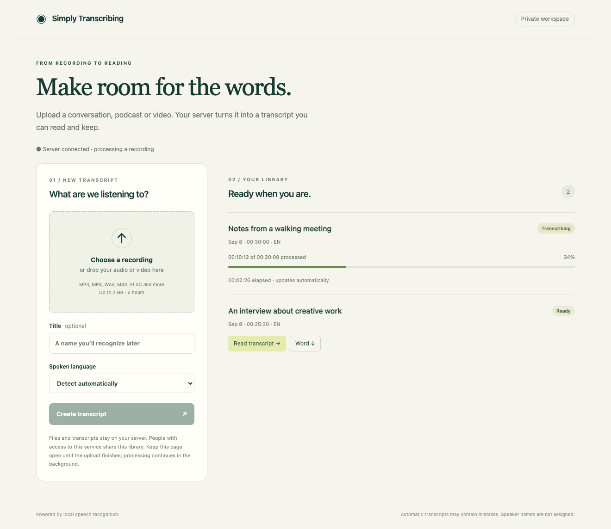

# Simply Transcribing

A self-hosted audio and video transcription workspace. Upload a recording, follow its progress, then read the transcript or download Word documents and subtitles.



## Features

- Runs on a **CPU by default**, with optional **NVIDIA CUDA** acceleration.
- Selectable Whisper models, from `tiny` to `large-v3`, and configurable compute type, threads and device index.
- Linux, macOS and Windows launch through the same Python entry point; WSL is an optional deployment choice.
- Separate upload and transcription progress, a shared library and timestamped reading view.
- Word, text, SRT, Markdown and JSON downloads.
- Local-browser access or private HTTPS through Tailscale Serve.
- Serial jobs, incremental segment journals and durable completion receipts.

The browser accepts recordings up to 2 GiB and 6 hours. Hardware, model size and available RAM determine practical throughput and capacity; large recordings may require much more RAM than model weights alone. Automatic transcripts can contain mistakes. Speaker identification, translation and editorial summarization are not included.

## Quick start

Install Python 3.11+ and FFmpeg (`ffprobe` must be on PATH), then clone the repository:

```bash
git clone https://github.com/phoenixjyb/simplyTranscribing.git
cd simplyTranscribing
python -m venv .venv
```

Activate the environment with `source .venv/bin/activate` on Linux/macOS or `.venv\Scripts\Activate.ps1` in Windows PowerShell, then:

```bash
python -m pip install -r requirements.txt
python app.py init
python app.py start
```

Open **http://127.0.0.1:8020**. The default is local-only access, CPU inference, the `base` model and automatic compute-type selection. The first inference downloads model files; subsequent runs use the local cache. To cache a model before going offline, run `python download_model.py --model base` and set `offline` to `true` in `runtime.json`.

Configuration, models and recordings live in the OS user-data directory, independently of the source checkout. Set `TRANSCRIBER_DATA_DIR` to use a different directory. `app.py init` prints the chosen directory and refuses to overwrite existing access configuration. `python app.py doctor` reports a shareable summary without account identities or private paths.

See **[setup and configuration](docs/setup.md)** for CUDA, model choices, Tailscale access and upgrades. Platform-specific helpers are under [examples/wsl](examples/wsl/README.md), outside the core startup path.

## Hardware support

| Host | Execution path | Notes |
| --- | --- | --- |
| Linux | CPU; optional NVIDIA CUDA | Default installation does not install NVIDIA packages |
| macOS, Intel or Apple silicon | CPU | Metal/MPS acceleration is not implemented |
| Windows | CPU; optional NVIDIA CUDA | Native Python launcher; WSL not required |
| WSL2 | CPU; optional NVIDIA CUDA | Uses the same application with Windows-provided GPU support |

Support depends on available [CTranslate2 wheels and CUDA libraries](https://opennmt.net/CTranslate2/installation.html). CUDA does not support AMD/Intel GPUs through this backend. CI checks the application on Linux, macOS and Windows; it does not prove GPU compatibility on every device. See [validation boundaries](docs/validation.md).

## Development

```bash
python -m pip install -r requirements-test.txt
python -m unittest discover -p 'test_*.py' -v
python scripts/check_publication.py
```

Tests use generated media and mocked inference; they require FFprobe but no model download. Actual recognition should also be validated with a bounded recording on the chosen device. Read [CONTRIBUTING.md](CONTRIBUTING.md), [architecture](docs/architecture.md) and [SECURITY.md](SECURITY.md) before changing execution or access controls.

## Privacy and license

Recordings and transcripts stay on the configured server. Everyone allowed into an instance shares its library. No public sharing, telemetry endpoint or external transcription API is included; model downloads contact the selected model host. Treat runtime data and Git author metadata as private/public boundaries respectively; see [privacy guidance](docs/privacy.md).

The application is [MIT licensed](LICENSE). Dependencies and downloaded models retain their own licenses; see [third-party notices](THIRD_PARTY_NOTICES.md). The screenshot uses synthetic examples.
